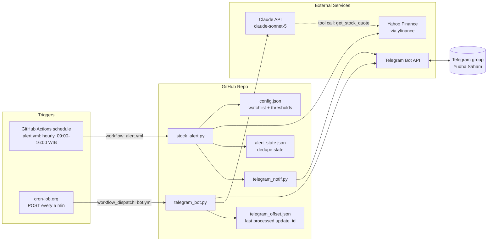
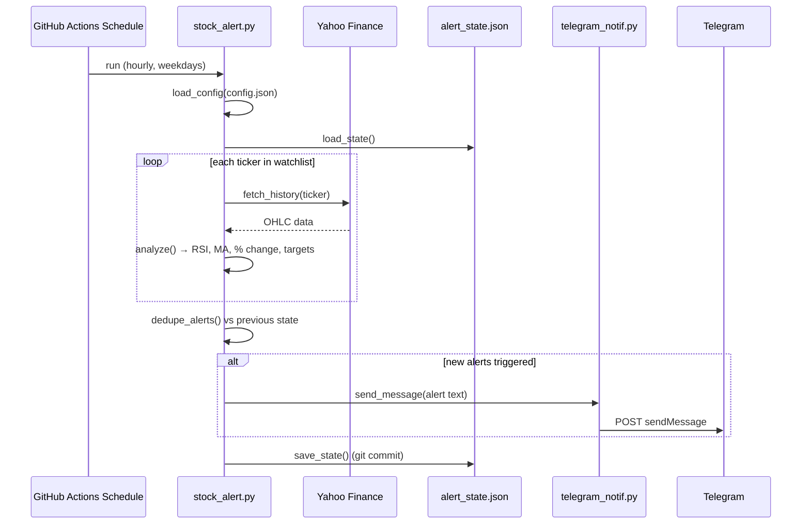
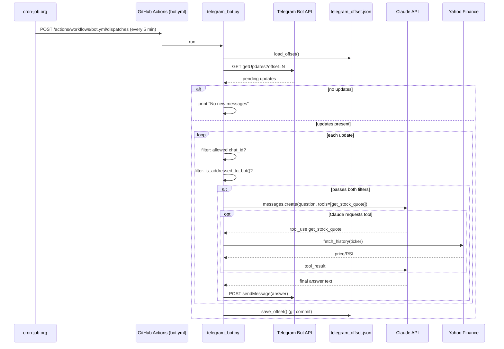

# Stock Alert Automation — Architecture & Flow Report

## System overview

## Flow 1 — Scheduled price alerts (`alert.yml` → `stock_alert.py`)

Runs hourly on weekdays. Checks every ticker in `config.json` against price
targets, daily volatility, RSI, and moving-average crossovers. Each
condition notifies once when it first triggers, then stays silent until it
clears (tracked in `alert_state.json`).

## Flow 2 — Conversational Q&A (`bot.yml` → `telegram_bot.py`)

Triggered every 5 minutes by an external cron (cron-job.org), since
GitHub's native schedule trigger proved unreliable for a 5-minute cadence.
Only messages from the configured chat (the group) are considered, and
within that group, only messages that `@mention` the bot or reply to one
of its messages are answered — enforced in code rather than relying on
Telegram's privacy-mode heuristics.

## Component reference

| File | Role |
|---|---|
| `config.json` | Watchlist (tickers, buy/sell targets) + alert thresholds |
| `stock_alert.py` | Fetches prices, computes indicators, dedupes, triggers alerts |
| `telegram_notif.py` | One-way Telegram `sendMessage` helper used by `stock_alert.py` |
| `telegram_bot.py` | Polls Telegram, filters by chat + mention/reply, answers via Claude |
| `alert_state.json` | Per-ticker per-condition dedupe flags (committed by `alert.yml`) |
| `telegram_offset.json` | Last processed Telegram `update_id` (committed by `bot.yml`) |
| `.github/workflows/alert.yml` | Hourly weekday schedule for `stock_alert.py` |
| `.github/workflows/bot.yml` | `workflow_dispatch`-triggered run of `telegram_bot.py` |
| cron-job.org (external) | Reliable 5-minute POST trigger for `bot.yml`, replacing GitHub's native schedule |
